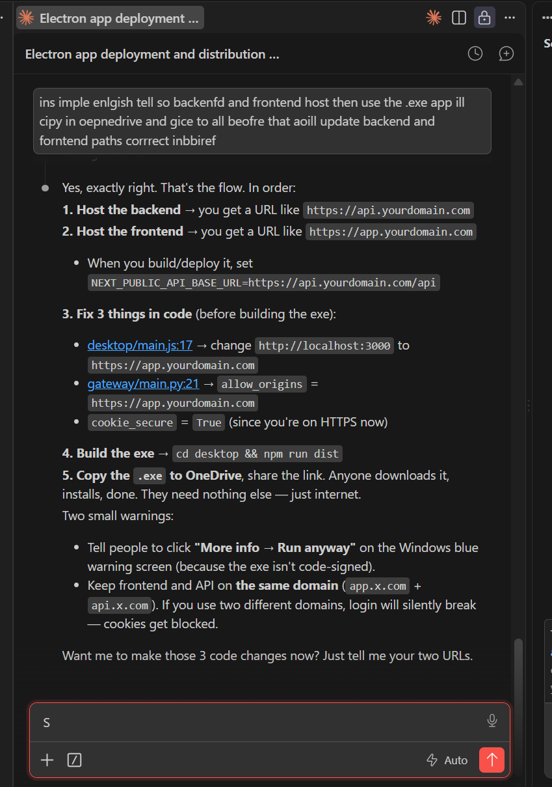
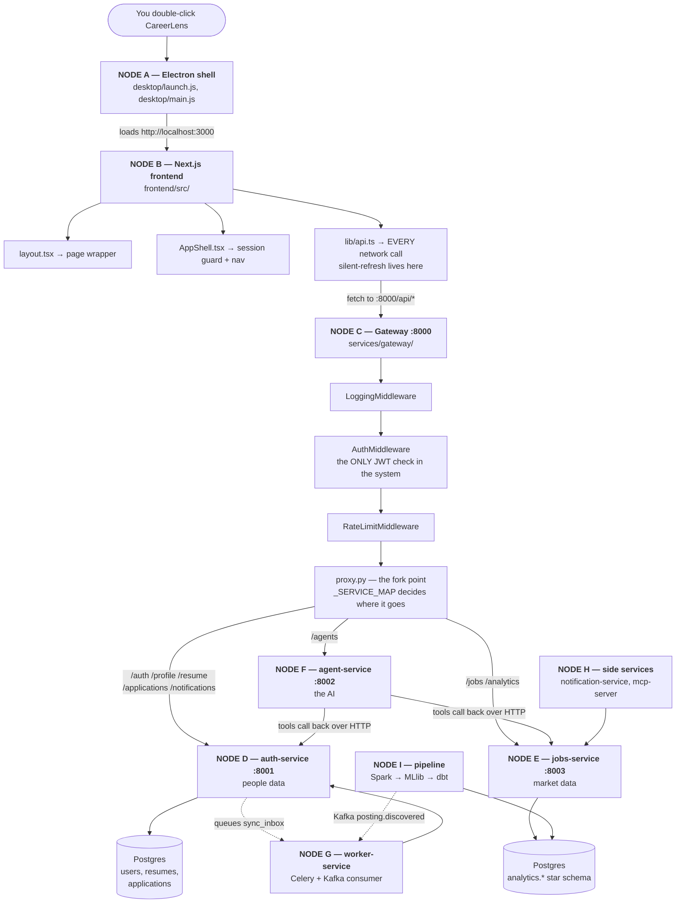

# ALL_IN_ONE.md — Read this repo file by file

This is a **reading route**, not a summary. Every code file worth opening manually is
listed below, in the order that makes it make sense, with a short note on *what it is*,
*why it exists*, and *what it hands off to next*.

**How to use it:** read a node here → open the file(s) it names → come back → follow the
arrow to the next node. Nothing below assumes more than basic-to-intermediate Python plus
"I can read TypeScript if the shape is explained."

**Two things to know before you start:**

1. This codebase is unusually heavily commented. Almost every file opens with a docstring
   explaining *why* it exists, and many comments record a real bug that was hit and fixed.
   Those comments are the best part of the repo — this file tells you which order to read
   them in, it does not replace them.
2. The Electron desktop app is a **thin shell**, not a rewrite. It adds one folder
   ([desktop/](desktop/)) and changes nothing else. Node A explains exactly what it does
   and does not do.

---

## 1. The 60-second mental model

CareerLens is a job-search tool made of three layers that were built to be readable
separately:

| Layer | What it does | Where it lives |
|---|---|---|
| **Product** | Login, job board, resume editor, application tracker, AI assistant | [frontend/](frontend/) + [services/](services/) |
| **Data** | 200k job postings → Spark clean → ML salary model → dbt star schema → Postgres | [pipeline/](pipeline/) |
| **Shell** | A desktop window wrapped around the product | [desktop/](desktop/) |

### 1.1 Every top-level folder, labelled

Before anything else — **what kind of thing each folder is.** These tags are used on every
node heading later in this file.

| Tag | Folder | Language | What it is |
|---|---|---|---|
| 🟩 **FRONTEND** | [frontend/](frontend/) | TypeScript / React | The web UI. 10 pages, 4 shared components, 2 lib files. Runs on :3000. |
| ⬜ **SHELL** | [desktop/](desktop/) | JavaScript | Electron window. 2 real code files. Not a service, not a server. |
| 🟦 **BACKEND** | [services/](services/) | Python / FastAPI | **The 7 microservices.** See §1.2. |
| 🟨 **PIPELINE** | [pipeline/](pipeline/) | Python / PySpark / SQL | Offline batch scripts. **Runs, finishes, exits.** No server, no port. |
| 🟥 **INFRA** | [infra/](infra/) [k8s/](k8s/) [.github/](.github/) | YAML / Docker | How it all runs. Compose, Helm, CI. |
| ⬜ **TESTS / DOCS** | [tests/](tests/) [docs/](docs/) | Python / Markdown | 3 test files, 11 prose docs. |

> **Rule of thumb:** if it has a `Dockerfile` *and* a `requirements.txt` *and* lives in
> `services/`, it's a microservice. Nothing else in this repo is one.

### 1.2 The seven microservices 🟦

**There are exactly 7. They are the 7 folders inside [services/](services/).** Verified —
that's the complete list, nothing hidden elsewhere.

| # | Service | Port | Owns | Read it in |
|---|---|---|---|---|
| 1 | **gateway** | **8000** | 🌍 **The only public door.** Verifies the JWT once, then forwards. No business logic. | §5 |
| 2 | **auth-service** | 8001 | Anything tied to a **person** — account, profile, resume, applications, Gmail creds, bell notifications. Biggest service. | §6 |
| 3 | **jobs-service** | 8003 | Anything tied to the **market** — job search, analytics. **No personal data at all.** | §7 |
| 4 | **agent-service** | 8002 | The AI — the agent loop, 6 agents, 7 tools, LangGraph. | §8 |
| 5 | **worker-service** | *(none)* | Slow work off the request path. **No HTTP port** — it pulls from a Redis queue. | §9 |
| 6 | **notification-service** | 8004 | Outbound email/SMS only. Smallest service in the repo. | §10 |
| 7 | **mcp-server** | 8005 | Exposes market data to external MCP clients. **Isolated network.** | §10 |

```
                    browser / Electron
                            │
                            ▼
                  ┌───────────────────┐
                  │  1. GATEWAY :8000 │   ← the ONLY one reachable publicly
                  └─────────┬─────────┘
        ┌───────────────────┼───────────────────┐
        ▼                   ▼                   ▼
  2. auth-service    3. jobs-service     4. agent-service
     :8001               :8003               :8002
                            ▲                   │
                            └───────────────────┘  agent tools call back over HTTP

  not on the request path ─────────────────────────────────────
  5. worker-service      Redis queue + Kafka consumer, no port
  6. notification-svc    :8004
  7. mcp-server          :8005  — own Docker network, cannot reach auth-service
```

**The definition that actually matters here** (not the buzzword one): own folder → own
`Dockerfile` + `requirements.txt` → own container/process → talks to the others **only over
the network**. The test that settles it: `agent-service` needs your resume, but it never
imports from `auth-service` — it makes an HTTP call to
`http://auth-service:8000/resume/active`. See
[tools/registry.py:141-147](services/agent-service/app/tools/registry.py#L141-L147).

**Two that will confuse you, so read these notes now:**

- **worker-service has no port and runs as *two* containers** from the same image — a Celery
  worker (`celery -A app.celery_app worker`) and a Kafka consumer
  (`python -m app.consumers.match_notifier`). See
  [infra/docker-compose.yml:191-229](infra/docker-compose.yml#L191-L229).
- **mcp-server is on its own Docker network** (`mcp-net`) and *literally cannot resolve*
  `auth-service`. That's a security boundary enforced by topology, not by code — §10.

**What is NOT a microservice** (so you don't go hunting):

| Not a service | Why |
|---|---|
| [frontend/](frontend/) | Separate app, its own container, but not in `services/` and speaks no service-to-service protocol. |
| [pipeline/](pipeline/) | **Scripts that run and exit.** No server, no port, no Dockerfile of its own. |
| Postgres · Redis · Kafka | Third-party infrastructure — pulled as images, not written here. |
| Agent "tools" | Just Python functions in one file. Not processes. |
| `routers/` files | Modules *inside* one service. ⚠️ Same word, two meanings — `jobs-service` is a microservice; `routers/jobs.py` is a file inside it. |

### 1.3 The numbers, up front

Every figure below was counted from the code, not estimated:

| Thing | Count | Where |
|---|---|---|
| Microservices | **7** | [services/](services/) — §1.2 |
| **AI agents** | **6** | `skill_extractor`, `profile_extractor`, `job_matcher`, `resume_tailor`, `market_analyst`, `email_classifier` — [definitions.py](services/agent-service/app/agents/definitions.py), §8 F4 |
| Agent tools | **7** | [registry.py](services/agent-service/app/tools/registry.py) `TOOL_IMPLEMENTATIONS`, §8 F3 |
| Ways to answer a question | **3** | explicit · routed · orchestrated — [orchestrator.py](services/agent-service/app/agents/orchestrator.py), §8 F5 |
| LLM providers supported | **4** | Anthropic, OpenAI, Fireworks, Gemini — [provider.py](services/agent-service/app/llm/provider.py) |
| Gateway route prefixes | **8** | `_SERVICE_MAP` — §5 C3 |
| Database tables | **8** | `users`, `refresh_tokens`, `user_profiles`, `resume_versions`, `google_credentials`, `applications`, `application_events`, `notifications` — [models.py](services/auth-service/app/models.py), §6 D1 |
| Frontend pages | **10** | [frontend/src/app/](frontend/src/app/), §4 B4 |
| MCP tools exposed | **8** | [mcp-server/app/main.py](services/mcp-server/app/main.py), §10 |
| Pipeline steps | **8** | [run_pipeline.py](pipeline/run_pipeline.py), §11 I1 |
| dbt model files | **7** | [pipeline/dbt/models/](pipeline/dbt/models/), §11 I6 |
| k8s/Helm files | **10** | [k8s/](k8s/), §12 |
| Test files | **3** | [tests/](tests/), §13 |

---

## 2. The master graph



**The single most important arrow** is `C2 → C4`: the gateway verifies the JWT once, then
sets `X-User-Id` / `X-User-Role` headers. Every downstream service *trusts those headers
and never checks a token itself*. Understand that and half the codebase's design falls out
of it.

---

## 3. NODE A — The Electron desktop shell

> ⬜ **SHELL** · JavaScript · everything below is in `desktop/` · **not a microservice**

**This is the newest layer and the one you asked about, so it goes first.**

### What was added

Exactly one folder. Nothing in `frontend/`, `services/`, or `pipeline/` was modified to
make the desktop app work.

```
desktop/
├── launch.js          ← run this (npm start)
├── main.js            ← the actual Electron app
├── package.json       ← deps + electron-builder config
├── package-lock.json
├── node_modules/      ← gitignored
└── dist/              ← gitignored — built installer lands here
```

Plus three lines in the root [.gitignore:19-21](.gitignore#L19-L21) so the 99 MB installer
and `node_modules` never get committed.

### Read these two files, in this order

**1 · [desktop/launch.js](desktop/launch.js)** — 24 lines, read it first because it is
pure "here is a real-world environment gotcha."

It exists because `electron .` **fails inside the VS Code terminal**. VS Code is itself an
Electron app, and it exports `ELECTRON_RUN_AS_NODE=1` to every process it spawns. With
that set, Electron boots as plain Node, `require("electron")` returns a *path string*
instead of the API object, and `main.js` dies on
`TypeError: Cannot read properties of undefined (reading 'whenReady')`.

So this file: deletes that env var → spawns the real Electron binary → forwards the exit
code. That's it.

**2 · [desktop/main.js](desktop/main.js)** — 63 lines, the whole desktop app.

Read it looking for these four things:

| Lines | What it does | Why it matters |
|---|---|---|
| [:17](desktop/main.js#L17) | `APP_URL = process.env.APP_URL \|\| "http://localhost:3000"` | **The key line.** The window loads a real HTTP origin — it does not load files from disk. |
| [:28-33](desktop/main.js#L28-L33) | `contextIsolation: true, nodeIntegration: false` | The renderer is sandboxed. The page gets no filesystem or Node access. |
| [:40-44](desktop/main.js#L40-L44) | retry loop on `did-fail-load` | Next's dev server takes seconds to boot; without this the window shows an error page and stays there. |
| [:48-51](desktop/main.js#L48-L51) | `setWindowOpenHandler` → `shell.openExternal` | Clicking a job posting opens your real browser instead of trapping you in a window with no address bar. |

### How it links to the existing setup — the important part

Because the window loads `http://localhost:3000` (a **real origin**), not `file://`:

- **Cookie auth keeps working, untouched.** The `httpOnly` `access_token` / `refresh_token`
  cookies that [frontend/src/lib/api.ts](frontend/src/lib/api.ts) relies on behave exactly
  as they do in Chrome. A `file://` page has no origin, so cookies would have broken and
  the whole auth layer would have needed rewriting.
- **CORS keeps working.** The gateway allows exactly one origin
  ([services/gateway/app/core/config.py:11](services/gateway/app/core/config.py#L11) →
  `http://localhost:3000`). Electron sends that origin, so nothing changes.
- **Zero backend changes.** The gateway cannot tell Electron from Chrome.

So the mental model is: **Electron is a browser with one bookmark and no address bar.**

### ⚠️ The current gap you should know about

[desktop/package.json:14-17](desktop/package.json#L14-L17) declares:

```json
"files": ["main.js", "package.json"]
```

That means the built `app.asar` is **2,894 bytes** — it contains no frontend. The 99 MB
`CareerLens Setup 1.0.0.exe` is 99 MB of Electron runtime wrapping those two small files.
And the frontend has no production build to point at: `frontend/.next/` contains only
`dev`, `frontend/out/` doesn't exist, and [frontend/next.config.ts](frontend/next.config.ts)
has no `output: "export"`.

**Consequence:** install that `.exe` on a fresh machine and you get a blank window
retrying `localhost:3000` forever. To actually run it today:

```powershell
# terminal 1 — the stack
cd infra; docker compose up -d
# terminal 2 — the frontend (Electron NEEDS this running)
cd frontend; npm run dev
# terminal 3 — the window
cd desktop; npm start
```

Two ways to close the gap when you want to:
1. **Offline app** — add `output: "export"` to the Next config, `npm run build`, add
   `frontend/out` to electron-builder's `files`, and `loadFile` it in production. Costs you
   server-side Next features.
2. **Keep the dev-server model** — leave it, and document that the frontend must run first.

**→ Next: NODE B, the thing the window is actually showing.**

---

## 4. NODE B — The frontend (Next.js 16 + React 19)

> 🟩 **FRONTEND** · TypeScript/React · all paths below start `frontend/src/` · port **3000**
> · **not a microservice** (separate app, own container)

```
frontend/src/
├── app/              ← one folder per URL (App Router)
├── components/       ← shared UI
└── lib/              ← non-UI logic  ← START HERE
```

### B1 · The one file to read properly

**[frontend/src/lib/api.ts](frontend/src/lib/api.ts)** — 357 lines. **Read this in full.**
It is the entire client/server contract in one place, and the TypeScript interfaces in it
are the best index of what the backend returns.

Three mechanisms to understand:

| What | Where | Why |
|---|---|---|
| `credentials: "include"` | [:74](frontend/src/lib/api.ts#L74) | The single line that makes cookie auth work cross-origin (page on :3000, API on :8000). Without it the browser silently omits the cookies. |
| **Silent refresh** | [:44-59](frontend/src/lib/api.ts#L44-L59) | Access tokens live 15 min. On a 401, call `/auth/refresh` once and replay the original request. The user never notices. |
| **The shared promise** | [:44](frontend/src/lib/api.ts#L44) `refreshInFlight` | Read the comment above it. Refresh *rotates* the token — so if two 401s each started their own refresh, the second would present a token the first already invalidated, **logging the user out precisely because the rotation security worked.** One in-flight refresh, everyone awaits it. |

Also note [:37-42](frontend/src/lib/api.ts#L37-L42) `NO_REFRESH_RETRY` — four paths matched
**exactly**, not by prefix. The comment explains why a `/auth/` prefix check was wrong.

### B2 · The other lib file

**[frontend/src/lib/pendingRequests.ts](frontend/src/lib/pendingRequests.ts)** — 99 lines.
A **mailbox** for in-flight AI requests. Read the header comment: it lists four bug
iterations in the order they appeared. The final insight is that a *subscription list* is
the wrong shape — if the request finishes while you're on another page, there's nobody
subscribed and the answer is lost. A mailbox *holds* the result until someone collects it.

Good file for learning why "it works on my machine" and "it works" differ.

### B3 · Shared components

| File | Lines | What to look for |
|---|---|---|
| [components/AppShell.tsx](frontend/src/components/AppShell.tsx) | 243 | Wraps every signed-in page. **Read [:38-77](frontend/src/components/AppShell.tsx#L38-L77)** — only a real 401/403 redirects to login; a network error retries with exponential backoff. The old `.catch(() => router.push("/login"))` bounced you to login whenever a container restarted. |
| [components/NotificationBell.tsx](frontend/src/components/NotificationBell.tsx) | 168 | Where Kafka job-matches surface. The comment defends in-app over email: 200 matching jobs = 200 emails = marked as spam. |
| [components/Charts.tsx](frontend/src/components/Charts.tsx) | 681 | Hand-written inline SVG charts — no charting library, so nothing is a black box. Skim unless you care about dataviz. |
| [components/AuthLayout.tsx](frontend/src/components/AuthLayout.tsx) | 99 | Two-column shell for login/signup. Skim. |

### B4 · The pages (one folder = one URL)

| File | URL | What it is |
|---|---|---|
| [app/layout.tsx](frontend/src/app/layout.tsx) | — | Root HTML wrapper, fonts. 29 lines. |
| [app/page.tsx](frontend/src/app/page.tsx) | `/` | Landing page. A **server component** (no state/effects, so no client JS shipped). |
| [app/login/page.tsx](frontend/src/app/login/page.tsx) | `/login` | 87 lines. |
| [app/signup/page.tsx](frontend/src/app/signup/page.tsx) | `/signup` | 101 lines. |
| [app/dashboard/page.tsx](frontend/src/app/dashboard/page.tsx) | `/dashboard` | Landing after login. 135 lines. |
| [app/jobs/page.tsx](frontend/src/app/jobs/page.tsx) | `/jobs` | 429 lines. **Read [:9-14](frontend/src/app/jobs/page.tsx#L9-L14)** — the profile stores country *codes* (`in`), the warehouse stores region *names* (`India`). Without the map, profile ranking silently does nothing while the UI claims it's working. |
| [app/resume/page.tsx](frontend/src/app/resume/page.tsx) | `/resume` | 546 lines. Upload, version list, AI chat. |
| [app/applications/page.tsx](frontend/src/app/applications/page.tsx) | `/applications` | 320 lines. Funnel + Gmail sync button. |
| [app/analytics/page.tsx](frontend/src/app/analytics/page.tsx) | `/analytics` | 160 lines. Six charts = six parallel API calls (this is why the rate limit is 300/min, not 60). |
| [app/copilot/page.tsx](frontend/src/app/copilot/page.tsx) | `/copilot` | 534 lines. The AI assistant UI. Shows the tool-call trace. |
| [app/profile/page.tsx](frontend/src/app/profile/page.tsx) | `/profile` | 320 lines. **Read the docstring** — the profile is an *input* to job fetching and agent ranking, not a settings page. |
| [app/health/route.ts](frontend/src/app/health/route.ts) | `/health` | 17 lines. **Read the whole comment.** Deliberately shallow: it must not check the backend, or one service's blip would restart a healthy frontend pod. |

### B5 · Frontend config

[package.json](frontend/package.json) · [next.config.ts](frontend/next.config.ts) ·
[tsconfig.json](frontend/tsconfig.json) · [Dockerfile.dev](frontend/Dockerfile.dev) (dev,
hot reload) · [Dockerfile](frontend/Dockerfile) (prod, baked build).

> `frontend/AGENTS.md` and `frontend/CLAUDE.md` are auto-generated by `next dev`. Ignore.

**→ Next: NODE C. Every arrow from `api.ts` points there.**

---

## 5. NODE C — The Gateway (the fork point) 🔑

> 🟦 **BACKEND** · microservice **1 of 7** · Python/FastAPI · all paths below start
> `services/gateway/app/` · port **8000** · 🌍 **the only public one**

**Port 8000. The only service a browser is ever allowed to talk to.** Read this node
carefully — it's small and it explains the shape of everything downstream.

```
services/gateway/app/
├── main.py                        ← middleware wiring  (READ FIRST)
├── core/config.py                 ← settings + the rate-limit story
├── middleware/
│   ├── logging_middleware.py
│   ├── auth_middleware.py         ← 🔑 the ONE JWT check
│   └── rate_limit.py
└── routers/proxy.py               ← 🔑 the fork point
```

### C1 · [services/gateway/app/main.py](services/gateway/app/main.py) — 33 lines

Read [:12-17](services/gateway/app/main.py#L12-L17). **Middleware runs in reverse of the
order added** (last added runs first). So the actual order is:

```
request → CORS → Logging → Auth → RateLimit → proxy → downstream service
```

The ordering is deliberate: rate limiting must run *after* auth so it can key on the
now-known `user_id` rather than a shared IP.

### C2 · [services/gateway/app/middleware/auth_middleware.py](services/gateway/app/middleware/auth_middleware.py) — 48 lines 🔑

**The most load-bearing 48 lines in the repo.** This is the only place a JWT is verified
against a raw cookie.

- [:19-27](services/gateway/app/middleware/auth_middleware.py#L19-L27) `PUBLIC_PATHS` is an
  **allow-list, not a deny-list**. A newly added route is secure by default; someone has to
  *deliberately* opt it out of auth rather than forget to opt it in.
- [:45-46](services/gateway/app/middleware/auth_middleware.py#L45-L46) — on success it
  attaches `request.state.user_id` / `user_role`. That's the handoff to proxy.py.

### C3 · [services/gateway/app/routers/proxy.py](services/gateway/app/routers/proxy.py) — 117 lines 🔑

The fork point. Four things to read:

**a) [:15-29](services/gateway/app/routers/proxy.py#L15-L29) — `_SERVICE_MAP`.** This is
the routing table for the whole backend. Memorise it:

| Public path | Goes to | Note |
|---|---|---|
| `/api/auth/*` | auth-service `/auth` | |
| `/api/profile/*` | auth-service `/profile` | |
| `/api/applications/*` | auth-service `/applications` | shares a DB with identity — splitting would turn a join into a network call |
| `/api/resume/*` | auth-service `/resume` | |
| `/api/notifications/*` | auth-service `/notifications` | *inbound* bell notifications |
| `/api/jobs/*` | jobs-service `/jobs` | |
| `/api/analytics/*` | jobs-service `/analytics` | |
| `/api/agents/*` | agent-service `/agents` | |

**b) [:35-48](services/gateway/app/routers/proxy.py#L35-L48) — `_STRIP_REQUEST_HEADERS`.**
`x-user-id` and `x-user-role` are stripped for a **security** reason, not a protocol one.
Downstream services trust those headers as proven identity — so if a browser could send its
own, anyone could impersonate any user by typing a header. *Trusted-header auth is only safe
when exactly one component can write the header.*

**c) [:64-71](services/gateway/app/routers/proxy.py#L64-L71) — two routes, not one.**
`/{service}/{path:path}` alone does not match a bare `/api/profile` — FastAPI answers with
a 307 redirect, and **a redirected cross-origin request silently drops credentials**. Looks
exactly like an auth bug in the logs.

**d) [:109-114](services/gateway/app/routers/proxy.py#L109-L114) — `multi_items()`, not
`dict()`.** A login response sets *two* `Set-Cookie` headers. Collapsing into a dict keeps
only one → "login works but refresh doesn't."

### C4 · The other two middlewares

- [rate_limit.py](services/gateway/app/middleware/rate_limit.py) — sliding window in Redis,
  keyed by user (falls back to IP for anonymous). **Redis, not in-memory**, because with two
  gateway replicas an in-memory counter gives an attacker two separate quotas.
- [logging_middleware.py](services/gateway/app/middleware/logging_middleware.py) — times
  every request. 25 lines.

### C5 · [services/gateway/app/core/config.py](services/gateway/app/core/config.py)

Read [:20-32](services/gateway/app/core/config.py#L20-L32). The rate limit was 60/min and
that was **a bug with a plausible error message**: one Analytics page load fires six
requests, the dashboard several more, and the bell polls every 60s — so normal clicking
exhausted the budget. Now 300/min.

**→ From here the graph forks three ways: D, E, F.**

---

## 6. NODE D — auth-service (everything that belongs to a person)

> 🟦 **BACKEND** · microservice **2 of 7** · Python/FastAPI · all paths below start
> `services/auth-service/app/` · port **8001** · private · **owns 8 of the 8 DB tables**

**Port 8001.** Owns: accounts, sessions, profile, resumes, applications, Gmail creds,
in-app notifications.

```
services/auth-service/app/
├── main.py                  ← router wiring + table creation
├── db.py                    ← SQLAlchemy engine + get_db()
├── models.py                ← 🔑 THE DATA MODEL — read this early
├── schemas.py               ← Pydantic request/response shapes
├── deps.py                  ← 🔑 how identity is resolved
├── core/
│   ├── config.py
│   ├── security.py          ← 🔑 all password/JWT crypto
│   ├── crypto.py            ← Fernet encryption for Google tokens
│   └── resume_parser.py     ← .tex/.pdf/.docx → text
└── routers/
    ├── auth.py              ← 🔑 the login lifecycle
    ├── profile.py
    ├── google_oauth.py
    ├── resume.py
    ├── applications.py
    └── notifications.py
```

### D1 · [models.py](services/auth-service/app/models.py) — 262 lines 🔑 **read first**

The seven tables. **Every class has a docstring explaining why it exists** — this file
alone teaches you the product.

| Model | What | The "why" worth reading |
|---|---|---|
| `User` | account | |
| `RefreshToken` | [:41](services/auth-service/app/models.py#L41) | Only the **hash** is stored, same as passwords. These rows are the source of truth for "is this session still valid" — exactly what a stateless JWT *cannot* tell you. |
| `UserProfile` | [:58](services/auth-service/app/models.py#L58) | Drives both job **search** (values become API query params) and job **ranking**. `skills` is comma-separated text, not a Postgres array, for engine portability. |
| `ResumeVersion` | [:98](services/auth-service/app/models.py#L98) | **Never overwritten.** Versioning gives safety (an AI rewrite can't destroy the original) *and* measurement (which version got more replies). |
| `GoogleCredential` | [:142](services/auth-service/app/models.py#L142) | Encrypted at rest. A leaked DB should not equal a leaked inbox. |
| `Application` | [:173](services/auth-service/app/models.py#L173) | The fact table of the job hunt. |
| `ApplicationEvent` | [:206](services/auth-service/app/models.py#L206) | Append-only history. `gmail_message_id` is UNIQUE — that's the **idempotency key** that makes re-syncing safe at the *database* level rather than hoping the code remembers to check. |
| `Notification` | [:232](services/auth-service/app/models.py#L232) | UNIQUE on `(user_id, posting_id)`: "tell them once" enforced by the DB, not by a consumer's memory that resets on restart. |

### D2 · [core/security.py](services/auth-service/app/core/security.py) — 80 lines 🔑

All crypto in one auditable file.

- [:20-26](services/auth-service/app/core/security.py#L20-L26) — bcrypt only reads the
  first **72 bytes**. Pre-hashing with SHA-256 maps any-length password to a fixed 64 chars,
  so nothing is silently discarded.
- [:64-68](services/auth-service/app/core/security.py#L64-L68) — the refresh token is an
  **opaque random string, NOT a JWT**. That's the whole point: it's stored server-side so it
  can be revoked instantly.
- [:71-75](services/auth-service/app/core/security.py#L71-L75) — refresh tokens get a
  *fast* hash (SHA-256), not bcrypt. bcrypt's slowness defends low-entropy human passwords;
  there's nothing to brute-force in 64 random bytes.

### D3 · [routers/auth.py](services/auth-service/app/routers/auth.py) — 131 lines 🔑

The full login lifecycle. Trace `signup → login → refresh → logout → me`.

The key function is **`refresh()` at [:90-115](services/auth-service/app/routers/auth.py#L90-L115)**:
it issues a new access token **and rotates the refresh token** (old revoked, new issued).
Rotation is what lets you *detect theft* — a refresh token used a second time after
rotation is a strong signal it leaked.

Also [:79-82](services/auth-service/app/routers/auth.py#L79-L82): login returns a
deliberately generic error for both "no such user" and "wrong password". Distinguishing them
lets an attacker enumerate valid emails.

### D4 · [deps.py](services/auth-service/app/deps.py) — 47 lines 🔑

**This closes the loop with the gateway.** `get_current_claims()` resolves identity from
either:
1. the `X-User-Id` header (set by the gateway, or by another service making an internal call), or
2. the `access_token` cookie (for hitting this service directly via `/docs`).

Read the docstring — it states *why* the header is trustworthy: the gateway strips
client-supplied copies, and this service is never published to the internet. Being explicit
about that is the whole game; the same pattern without a gateway is a critical vulnerability.

`require_role()` at [:37](services/auth-service/app/deps.py#L37) is the RBAC dependency factory.

### D5 · The routers

| File | What | Read for |
|---|---|---|
| [profile.py](services/auth-service/app/routers/profile.py) | Profile CRUD | GET **creates** an empty profile rather than 404-ing, so the UI never needs a "does it exist yet" branch. |
| [resume.py](services/auth-service/app/routers/resume.py) | Upload / version / edit / download | The format hierarchy: `.tex` round-trips, **`.pdf` is import-only** (PDF stores glyphs and positions, not structure — there's no reliable path back). |
| [google_oauth.py](services/auth-service/app/routers/google_oauth.py) | OAuth2 authorization-code flow | Read the header docstring end to end. Two params that are easy to skip: **`state`** (without it an attacker links *their* Google account to *your* session) and **`access_type=offline` + `prompt=consent`** (without them you get a 1-hour token and background sync dies when the tab closes). |
| [applications.py](services/auth-service/app/routers/applications.py) | Tracking + funnel | `/funnel` answers "what happens to my applications"; `/resume-performance` answers "which version gets more replies". Those two are why the feature exists. |
| [notifications.py](services/auth-service/app/routers/notifications.py) | The bell | **Write path is separate from read path.** Users read with a cookie; the Kafka consumer writes with an internal header, because it acts *on behalf of* a user it isn't logged in as. |

### D6 · Supporting core files

- [core/crypto.py](services/auth-service/app/core/crypto.py) — Fernet. Read the docstring:
  a password is *verified, never recovered* → one-way hash. A Google refresh token must be
  **used** later → reversible → encryption. Confusing the two is a classic mistake in both
  directions.
- [core/resume_parser.py](services/auth-service/app/core/resume_parser.py) — format-by-format
  reality for `.tex` / `.pdf` / `.docx` / `.txt`.
- [db.py](services/auth-service/app/db.py) (19 lines) · [schemas.py](services/auth-service/app/schemas.py) ·
  [main.py](services/auth-service/app/main.py) — quick reads.

---

## 7. NODE E — jobs-service (market data, no personal data)

> 🟦 **BACKEND** · microservice **3 of 7** · Python/FastAPI · all paths below start
> `services/jobs-service/app/` · port **8003** · private · reads the 🟨 pipeline's output

**Port 8003.** Reads only the dbt-built `analytics.*` star schema. Never the raw Spark
output, never the pipeline.

```
services/jobs-service/app/
├── main.py
└── routers/
    ├── jobs.py        ← 🔑 search + filters + the cache decorator
    └── analytics.py   ← the six chart endpoints
```

### E1 · [routers/jobs.py](services/jobs-service/app/routers/jobs.py) — 280 lines 🔑

The single best backend file for learning practical SQL + caching. Four things:

**a) `cached()` at [:31-63](services/jobs-service/app/routers/jobs.py#L31-L63)** —
cache-aside (check → miss → query → store → return). Two lessons in the docstring:
- Every Redis call is wrapped in try/except. **A cache is an optimization, never a dependency.**
- `functools.wraps` is **load-bearing, not cosmetic**: FastAPI builds each route's request
  model by *inspecting the handler's signature*. Without `@wraps` it sees `(*args, **kwargs)`
  and demands query parameters literally named `args` and `kwargs`.

**b) `search_jobs()` at [:110](services/jobs-service/app/routers/jobs.py#L110)** — every
user value goes in as a **bound parameter** (`:q`, `:skill`), never string interpolation.
That is what makes SQL injection impossible here.

**c) Rank-don't-filter, [:174-217](services/jobs-service/app/routers/jobs.py#L174-L217)** —
a user in India sees Indian roles *first*, but US roles aren't hidden. Two real Postgres
bugs are documented inline:
- A bare `0` can't be the no-op rank — Postgres reads a plain integer in `ORDER BY` as a
  **column position**, so `ORDER BY is_real DESC, 0 DESC` errors out.
- `ORDER BY` must reference the output **alias**, not a second copy of the subquery.
  Repeating it made Postgres evaluate a correlated count twice per row over 151k rows and
  exhausted shared memory.

**d) `is_real DESC` always first, [:230-238](services/jobs-service/app/routers/jobs.py#L230-L238)** —
real postings have a URL you can apply through; synthetic ones exist to give the pipeline
volume. Sorting by salary alone buried every real posting.

### E2 · [routers/analytics.py](services/jobs-service/app/routers/analytics.py)

Six SQL aggregations, each cached. **Read the `::float` note at the top:** Postgres
`ROUND()` on a numeric returns `numeric` → psycopg maps it to `Decimal` → not
JSON-serializable → gets stringified → the API returns `"avg_salary": "118322"` and the
frontend's `.toLocaleString()` silently does nothing to a string.

Metrics: `overview`, `top-skills`, `salary-by-seniority`, `salary-by-region`,
`postings-by-month`, `skill-premium`.

---

## 8. NODE F — agent-service (the AI layer) 🔑

> 🟦 **BACKEND** · microservice **4 of 7** · Python/FastAPI · all paths below start
> `services/agent-service/app/` · port **8002** · private
> · **6 agents · 7 tools · 3 answering modes · 4 LLM providers**

**Port 8002.** This is the most interesting node. Read it in the exact order below.

```
services/agent-service/app/
├── main.py
├── core/config.py
├── llm/provider.py           ← 2nd: provider abstraction
├── tools/registry.py         ← 3rd: what tools actually DO
├── agents/
│   ├── base.py               ← 1st: 🔑 THE AGENT LOOP
│   ├── definitions.py        ← 4th: the capability model
│   └── orchestrator.py       ← 5th: routing vs orchestration
├── langgraph_impl/graph.py   ← 6th: the same thing, via a framework
└── routers/agents.py         ← the HTTP surface
```

### F1 · [agents/base.py](services/agent-service/app/agents/base.py) — 165 lines 🔑🔑

**If you read one file in this repo, read this one.** Strip away the vocabulary and an
"agent" is:

```
1. Send the LLM the conversation so far + the tools it may call
2. It replies with either a final answer OR a request to call a tool
3. If it's a tool request: run the real Python function, get a real result
4. Feed that result back into the conversation, go to 1
5. Stop when it answers instead of calling another tool
```

That's the whole thing. Multi-agent systems, planners, sub-agents — all of it is this loop
composed with itself.

Two guardrails, both added because of *measured* failures:

| Guard | Line | The failure it fixes |
|---|---|---|
| `seen_calls` cache | [:88-95](services/agent-service/app/agents/base.py#L88-L95) | A run issued `search_jobs` **13 times with identical arguments** while "thinking". Each repeat is a real HTTP round trip. |
| `MAX_CALLS_PER_TOOL = 3` | [:29-45](services/agent-service/app/agents/base.py#L29-L45) | The cache only catches *identical* calls. A model rewording — "Machine Learning Engineer", "ML Engineer", "Machine Learning" — defeats it completely. One run issued 30 searches, took 90s, and blew the gateway's timeout, so **the user saw "the assistant call failed" for a request that was still working.** |

Note also: when refusing, the code tells the model *what to do instead*. A bare error
invites a retry with different wording — exactly the behaviour being stopped.

### F2 · [llm/provider.py](services/agent-service/app/llm/provider.py) — 216 lines

Every agent calls `get_llm_provider().chat(...)` and never imports `anthropic`/`openai`
directly. Swapping providers becomes a config change instead of a rewrite.

Four providers: Anthropic, OpenAI, Fireworks, Gemini. Read for two real API-shape lessons:

- [:80-85](services/agent-service/app/llm/provider.py#L80-L85) — Anthropic: you must replay
  the **original content blocks**, not just the text, because each `tool_result` must
  reference the `tool_use` id it answers. Flattening to text produces `tool_use_id not found`.
- [:126-131](services/agent-service/app/llm/provider.py#L126-L131) — passing `tools=None`
  is **not** the same as omitting the field. OpenAI tolerates the null; Fireworks rejects it.
  That broke every *tool-less* agent while tool-using ones worked fine.

### F3 · [tools/registry.py](services/agent-service/app/tools/registry.py) — 267 lines

A "tool" is a plain Python function + a JSON-schema description. **The LLM never executes
anything** — it only *requests* a tool by name, and this module decides whether to run it.

`dispatch_tool_call()` at [:244](services/agent-service/app/tools/registry.py#L244) enforces
`allowed_tools` at **execution** time as well as prompt time. Restricting what an agent
*sees* is a soft boundary (a model can hallucinate a name); checking here is the hard one.

Two comments worth your time:
- `search_jobs` [:36-50](services/agent-service/app/tools/registry.py#L36-L50) — the
  docstring claimed "real postings" while the call passed no provenance filter, so the agent
  quietly padded recommendations with **generated** jobs. One run advised applying to
  "Johnson, Cooper and Reilly" — Faker output, with confident reasoning attached. *The worst
  failure mode this system has: not a wrong answer, but a plausible one.*
- `get_resume` [:128-139](services/agent-service/app/tools/registry.py#L128-L139) — it read
  `profile.resume_text`, which stopped being written once uploads moved to `resume_versions`.
  So it returned an empty resume and the agent asked the user to paste one they'd already
  uploaded. **Looked like a model problem, was a stale data path.** Nothing fails loudly
  because an empty string is a perfectly valid string.

### F4 · [agents/definitions.py](services/agent-service/app/agents/definitions.py) — 245 lines

Every agent, its prompt, and **the exact tools it may call**. Reading this file top to
bottom tells you the whole capability model — including what each agent *cannot* do.

| Agent | Tools | Can it… |
|---|---|---|
| `skill_extractor` | **none** | pure text → JSON |
| `profile_extractor` | **none** | reads a resume → structured fields. Cannot write the profile. |
| `job_matcher` | `get_profile`, `search_jobs`, `get_job` | read-only — changes nothing |
| `resume_tailor` | `get_resume`, `get_resume_latex`, `get_job`, `save_tailored_resume` | **the only agent that can modify a resume** |
| `market_analyst` | `get_market_analytics`, `search_jobs` | analytics only — can't see personal data |
| `email_classifier` | **none** | can never touch a resume |

> That last column is the answer to *"how do you stop an agent doing something dangerous?"*
> **You don't rely on the prompt asking nicely. You don't give it the tool.**

Also read `resume_tailor`'s HARD RULES at [:208-217](services/agent-service/app/agents/definitions.py#L208-L217)
— "never invent experience… a resume that lies is worse than a weak one, and the person has
to defend every line of it in an interview."

### F5 · [agents/orchestrator.py](services/agent-service/app/agents/orchestrator.py) — 396 lines 🔑

Three ways from question → answer, in increasing power and cost:

| Mode | Function | When |
|---|---|---|
| **explicit** | `route_explicit()` [:114](services/agent-service/app/agents/orchestrator.py#L114) | The UI already knows the intent. A "Tailor my resume" button is not ambiguous — spending an LLM call to classify it is pure waste. |
| **routing** | `route_with_llm()` [:159](services/agent-service/app/agents/orchestrator.py#L159) | A planner reads the question and picks **ONE** specialist. Cheap, predictable, but limited to what one agent can produce. |
| **orchestration** | `orchestrate()` [:260](services/agent-service/app/agents/orchestrator.py#L260) | Calls **SEVERAL** sub-agents and synthesises. Needed for "match jobs to my resume AND suggest fixes" — one agent knows the market, another knows the resume, neither alone can answer. |

> **Routing PICKS a worker. Orchestration COMBINES workers.** Most systems described as
> "multi-agent" are only routing.

The trick that makes orchestration need no new machinery is
`_delegation_tools()` at [:216](services/agent-service/app/agents/orchestrator.py#L216):
**each sub-agent is exposed as a tool.** From the orchestrator's point of view a sub-agent
*is* just a tool that happens to be expensive and intelligent — so the same loop in
`base.py` drives both levels.

Three failures documented inline, all worth reading:
- **`"none"` exists** [:170-193](services/agent-service/app/agents/orchestrator.py#L170-L193) — "hello" used to route to `job_matcher`, which read the profile, ran three searches and returned a full market report with skill-gap analysis. The planner literally said *"greeting does not require specialized response"* while picking one, because its prompt gave it no way to say none. **A router with no null option always returns its least-bad guess.**
- **`DELEGATABLE` ≠ all agents** [:121-134](services/agent-service/app/agents/orchestrator.py#L121-L134) — offering tool-less agents let the planner route "what are my skills" to `profile_extractor`, which with no tools could only answer `{"skills": [], ...}`. *It did its job perfectly on the input it was given.* Routing to an agent that cannot fetch anything is a **routing** bug, not a model bug.
- **user_id re-attached in code** [:265-273](services/agent-service/app/agents/orchestrator.py#L265-L273) — the sub-agent gets whatever the orchestrator *wrote*, so the `[user_id: …]` line survived only if the model copied it. Sometimes it did, sometimes it didn't. **Identity is not something to leave to a model's discretion.**

### F6 · [langgraph_impl/graph.py](services/agent-service/app/langgraph_impl/graph.py)

The same job-matching flow as a LangGraph graph. **Read it side by side with `base.py`** —
that comparison is the point:

| | Who decides the path |
|---|---|
| Hand-rolled ([base.py](services/agent-service/app/agents/base.py)) | The **model**, at runtime, by choosing tools. Max flexibility. |
| LangGraph ([graph.py](services/agent-service/app/langgraph_impl/graph.py)) | **You**, ahead of time. The model fills in each node. Predictable, inspectable, drawable. |

Open-ended requests want the model steering. A fixed business process wants the graph.

### F7 · [routers/agents.py](services/agent-service/app/routers/agents.py)

The HTTP surface: `GET /agents` (the capability model served as data) and `POST /agents/ask`.

---

## 9. NODE G — worker-service (async + events)

> 🟦 **BACKEND** · microservice **5 of 7** · Python/Celery · all paths below start
> `services/worker-service/app/` · ⚠️ **no HTTP port** — pulls from a Redis queue
> · runs as **two containers** from one image

Two completely different processes that happen to share an image.

```
services/worker-service/app/
├── celery_app.py             ← Celery config + beat schedule
├── gmail_client.py           ← raw Gmail REST client
├── crypto.py                 ← decrypt stored Google tokens
├── tasks/
│   ├── email_sync.py         ← 🔑 the flagship background job
│   └── scraping.py           ← placeholder (not yet wired)
└── consumers/
    └── match_notifier.py     ← 🔑 the Kafka consumer
```

### G1 · [celery_app.py](services/worker-service/app/celery_app.py) — 32 lines

Redis is both broker and result backend — the *same instance* the gateway uses for caching
and rate limiting, just a different logical use. The `beat_schedule` runs the scrape every
6 hours, which is what makes ingestion autonomous rather than "a script I remember to run."

### G2 · [tasks/email_sync.py](services/worker-service/app/tasks/email_sync.py) — 271 lines 🔑

Inbox → classified application status. Flow: read encrypted refresh token → Gmail search →
classify each message with the `email_classifier` agent → upsert into `applications` +
append an event.

**The best comments in the repo are the Gmail query at [:37-96](services/worker-service/app/tasks/email_sync.py#L37-L96).** Three lessons:

1. **Single generic words are useless.** `subject:(application OR offer)` returned a Red Hat
   API-key notice, a Samsung sale, and a GitHub OAuth alert. Those are just common English
   words.
2. **Body matching sounds more thorough and is strictly worse.** Adding body matches went
   from 4 hits to 20, with *more* noise — any newsletter containing "unfortunately" qualified.
   A real ATS mail puts the phrase in the **subject**.
3. **The LLM classifier is a safety net, not a filter.** It correctly rejected all the noise,
   but each rejection cost an API call. **The cheapest classification is the one you never make.**

Also [:216-226](services/worker-service/app/tasks/email_sync.py#L216-L226): **statuses never
regress.** An "applied" confirmation arriving after an interview invite must not knock the
application back a stage — so statuses are explicitly ranked rather than ordered by email
date (delivery delays make dates unreliable).

### G3 · [consumers/match_notifier.py](services/worker-service/app/consumers/match_notifier.py) — 185 lines 🔑

The Kafka consumer that turns `posting.discovered` events into bell notifications. **This
is the consumer that justifies Kafka in this project** — read [:1-16](services/worker-service/app/consumers/match_notifier.py#L1-L16).

Two things to understand:
- **`group_id`** [:132-135](services/worker-service/app/consumers/match_notifier.py#L132-L135) — Kafka tracks each *group's* offset separately, which is precisely how one event reaches several independent consumers without them coordinating.
- **`enable_auto_commit=False`** [:139-141](services/worker-service/app/consumers/match_notifier.py#L139-L141) — commit only *after* processing, so a crash reprocesses rather than silently drops. At-least-once, which suits notifications: a duplicate is survivable, a missed match is not.

Dedup lives in the **database** (`UNIQUE(user_id, posting_id)`), not here. *A consumer
restarts and forgets; the constraint does not.*

### G4 · [gmail_client.py](services/worker-service/app/gmail_client.py)

Deliberately raw `httpx` instead of `google-api-python-client` — ~80 lines you can actually
explain. Gmail's shape: `messages.list` returns only `{id, threadId}`, **not content**, so
syncing is inherently two-phase and the batch is capped.

### G5 · [tasks/scraping.py](services/worker-service/app/tasks/scraping.py)

21 lines, **currently a placeholder** returning `{"status": "not_yet_wired"}`. Read it so
you're not surprised later.

---

## 10. NODE H — The two side services

> 🟦 **BACKEND** · microservices **6 and 7 of 7** · Python · ports **8005** and **8004**
> · `mcp-server` sits on its own Docker network and cannot reach `auth-service`

### H1 · [services/mcp-server/app/main.py](services/mcp-server/app/main.py) — 150 lines 🔑

Exposes CareerLens's **job-market data** to any MCP client (Claude Desktop, Cursor, …).

**Read the privacy-boundary block at the top — it's the best security lesson in the repo.**

```
EXPOSED        search_jobs, job_details, market_overview, top_skills,
               skill_premium, salary_by_seniority
NEVER EXPOSED  email, resume, applications, profile, user accounts
```

That separation is enforced **structurally, not by convention**: this container runs on an
isolated Docker network (`mcp-net`) shared with jobs-service and *nothing else*. auth-service,
gateway, postgres and redis don't even resolve from here, and it holds no DB credentials.

Why that's load-bearing: auth-service trusts `X-User-Id` as proven identity — safe, because
only the gateway can set it. But **anything sharing its network could forge that header** and
read any user's resume or inbox. Docker Compose puts every service on one network by default,
which quietly made this server exactly that path until the networks were split. See
[infra/docker-compose.yml:258-264](infra/docker-compose.yml#L258-L264).

> The alternative — one server exposing everything with a flag deciding what's personal — is
> one bad conditional away from leaking an inbox. **Two services with different reach can't
> have that bug.**

### H2 · [services/notification-service/](services/notification-service/)

Deliberately the smallest service. Exists so a flaky email/SMS provider can never take down
login, agents, or the pipeline. Currently logs instead of sending. **2-minute read.**

> Note the split: `notification-service` is the **outbound** side (email/SMS providers).
> The in-app bell is **inbound** per-user data and lives in auth-service.

---

## 11. NODE I — The data pipeline

> 🟨 **PIPELINE** · Python/PySpark/SQL · all paths below start `pipeline/` · ⚠️ **not a
> microservice** — these are scripts that run, finish and exit. No server, no port.

**This is a self-contained project inside the project.** It runs offline and produces the
`analytics.*` tables that jobs-service serves.

```
pipeline/
├── run_pipeline.py               ← 🔑 START HERE — the whole flow in one file
├── paths.py                      ← Windows MAX_PATH workaround
├── events.py                     ← 🔑 Kafka publishing + honest justification
├── ingestion/
│   ├── generate_synthetic_data.py
│   ├── job_apis.py               ← real postings (Adzuna/Remotive/Arbeitnow)
│   └── load_to_warehouse.py
├── spark_jobs/
│   ├── spark_common.py
│   ├── etl_clean_jobs.py         ← 🔑 the main PySpark job
│   └── mllib_salary_model.py     ← the ML model
├── dbt/                          ← SQL transformations + tests
├── mapreduce_demo/               ← MapReduce vs Spark benchmark
└── airflow/dags/                 ← the scheduler
```

### I1 · [run_pipeline.py](pipeline/run_pipeline.py) — 174 lines 🔑 **read first**

Runs the whole batch pipeline in one command. **This file is the pipeline's table of
contents** — the eight numbered steps tell you what to read next and in what order:

```
1. generate    → ingestion/generate_synthetic_data.py    (200k synthetic postings)
2. real        → ingestion/job_apis.py                   (live job-board APIs)
3. spark       → spark_jobs/etl_clean_jobs.py            (clean, dedupe, aggregate)
4. mllib       → spark_jobs/mllib_salary_model.py        (train salary model)
5. load        → ingestion/load_to_warehouse.py          (Parquet → Postgres raw.*)
6. dbt run     → dbt/models/                             (build the star schema)
7. dbt test    → dbt/                                    (data-quality gate)
8. benchmark   → mapreduce_demo/benchmark_compare.py     (optional)
```

Also read `resolve_dbt_target()` at [:28](pipeline/run_pipeline.py#L28) — Snowflake if
configured, Postgres otherwise, **same models and same tests either way**. That's the actual
value of dbt over engine-specific scripts.

### I2 · [spark_jobs/etl_clean_jobs.py](pipeline/spark_jobs/etl_clean_jobs.py) — 154 lines 🔑

The main PySpark job. Three lessons:

**a) `clean_salary()` [:29-53](pipeline/spark_jobs/etl_clean_jobs.py#L29-L53)** — native
Spark SQL, **not a Python UDF**. A UDF forces every row out of the JVM into a Python worker
and back. *"Avoid Python UDFs when a native expression exists"* is one of the highest-value
Spark lessons there is.

**b) The decimal bug — read this one twice.** Stripping every non-digit turns `160000.0`
into `"1600000"` — a silent **10× inflation**. It went unnoticed for as long as every salary
was a whole number, because the synthetic generator only emitted ints. The moment real
postings arrived with fractional values, average US salary read **$10,186,234**.

> A transformation that is correct for all *current* inputs is not the same as a correct
> transformation. This one encoded "salaries have no decimals" as an assumption without ever
> stating it.

**c) `.cache()` at [:82](pipeline/spark_jobs/etl_clean_jobs.py#L82)** — `cleaned` is consumed
six times below. Without this, Spark recomputes the whole read+clean lineage each time. **One
line, often the difference between a slow job and a fast one.**

Also note the **bridge table** [:131-134](pipeline/spark_jobs/etl_clean_jobs.py#L131-L134):
one row per (posting, skill). Textbook many-to-many, and it sidesteps a real portability
problem — array types differ across engines (Postgres `text[]`+`unnest` vs Snowflake
VARIANT+`FLATTEN`), while a bridge table is plain rows every warehouse handles identically.

### I3 · [spark_jobs/mllib_salary_model.py](pipeline/spark_jobs/mllib_salary_model.py)

**Read the docstring for the honesty lesson.** Trained on everything, the model scored
**R² = 0.898** — but 96% of that was seniority, *because that's how the generator computes
salary*. It had recovered the generator, not the market. Trained on real postings only,
R² drops to **0.617** and region becomes dominant, which is a true fact about the world.

> **The lower number is the more honest one.** And GBT beats the linear baseline by a wider
> margin on it, so the complex model now earns its place instead of tying.

Also: predictions are computed in **batch** and written to the warehouse, not per request.
Features only change when the pipeline runs.

### I4 · [events.py](pipeline/events.py) — 185 lines 🔑

**Read the header for the most valuable paragraph in the repo:**

> **When Kafka is NOT justified:** if one producer feeds exactly one consumer, Kafka is
> strictly worse than a direct call or a database row. Most "we use Kafka" portfolio projects
> are this case, and an interviewer who knows the tool will spot it immediately.

Then the honest justification: `posting.discovered` has **multiple independent consumers that
must not know about each other** (warehouse loader, match notifier, future embedder).

Two mechanics worth knowing:
- `publish()` [:128-151](pipeline/events.py#L128-L151) **blocks on `.get()`**. `producer.send()`
  is async — an earlier version returned True right after send, reporting success for messages
  that never reached the broker. *A publisher that lies about delivery is worse than no publisher.*
- `_resolve_bootstrap()` [:33](pipeline/events.py#L33) — Kafka advertises two addresses
  (`kafka:9092` inside Docker, `localhost:29092` from the host). Getting it wrong produces
  **silence, not an error**, so it's auto-detected rather than configured.

### I5 · Ingestion

| File | What | Read for |
|---|---|---|
| [ingestion/job_apis.py](pipeline/ingestion/job_apis.py) | Real postings | **No scraping of sites whose ToS forbid it** (LinkedIn, Indeed). Sources: Adzuna (India + USA from one free key), Remotive (remote, no key), Arbeitnow (Europe, off by default). Search terms come from **user profiles**, not hardcoded. |
| [ingestion/generate_synthetic_data.py](pipeline/ingestion/generate_synthetic_data.py) | 200k synthetic rows | **Deliberately NOT clean** — ~2% duplicates and malformed salary strings injected on purpose, so the Spark ETL has real work to do. |
| [ingestion/load_to_warehouse.py](pipeline/ingestion/load_to_warehouse.py) | Parquet → Postgres | Two lessons: (1) Spark writes a *directory* of `part-*.parquet`, and a stray `_SUCCESS` marker makes some pandas versions **silently return zero rows**. (2) Loads via **COPY, not INSERT** — minutes vs seconds on 200k rows. |

### I6 · dbt — the star schema

```
pipeline/dbt/
├── dbt_project.yml
├── models/
│   ├── staging/sources.yml, stg_postings.sql
│   └── marts/
│       ├── dim_company.sql
│       ├── dim_skill.sql
│       ├── fact_job_posting.sql        ← read this one
│       └── bridge_posting_skill.sql
├── models/schema.yml                   ← the data-quality tests
├── macros/index_marts.sql
└── tests/generic/accepted_range.sql
```

Read [marts/fact_job_posting.sql](pipeline/dbt/models/marts/fact_job_posting.sql) (31 lines).
Note the **LEFT JOIN** to `posting_scores` — a posting with no salary can't be scored but must
still appear. *An inner join here would silently delete rows.* And note `is_real` carried onto
the fact table so the API can rank on provenance without joining back.

Then [models/schema.yml](pipeline/dbt/models/schema.yml) — the 17 data-quality tests. **This
is the gate**: a bad upstream run fails here instead of surfacing as garbage in the UI.

### I7 · The rest of pipeline/

- [spark_jobs/spark_common.py](pipeline/spark_jobs/spark_common.py) — three Windows Spark
  gotchas solved once: `PYSPARK_PYTHON` (the Microsoft Store alias stub kills workers with a
  misleading `SocketTimeoutException`), `JAVA_HOME`, and `HADOOP_HOME`/`winutils.exe` (reads
  work, **writes** fail).
- [paths.py](pipeline/paths.py) — Windows MAX_PATH. Spark *writes* long-named files fine and
  `glob()` *finds* them fine, but `open()` then fails on a file you can see. `\\?\` prefix fixes it.
- [mapreduce_demo/](pipeline/mapreduce_demo/) — [mapper.py](pipeline/mapreduce_demo/mapper.py),
  [reducer.py](pipeline/mapreduce_demo/reducer.py),
  [benchmark_compare.py](pipeline/mapreduce_demo/benchmark_compare.py). Same aggregation two
  ways, **median of N runs** because single-run laptop timings are noise.
- [airflow/dags/job_pipeline_dag.py](pipeline/airflow/dags/job_pipeline_dag.py) — each task
  shells out to a script that already works standalone. **The DAG sequences; it doesn't
  reimplement.**

---

## 12. NODE J — Infra, deployment, CI

> 🟥 **INFRA** · YAML/Docker · `infra/` · `k8s/` (10 files) · `.github/` · `.githooks/`
> · **not a microservice** — this is how the other pieces get run

| File | What to read it for |
|---|---|
| [infra/docker-compose.yml](infra/docker-compose.yml) 🔑 | **The best-commented infra file here.** See below. |
| [infra/.env.example](infra/.env.example) | Every env var the stack needs. |
| [infra/hadoop.env](infra/hadoop.env) | HDFS config. 7 lines. |
| [infra/airflow.Dockerfile](infra/airflow.Dockerfile) | Airflow image with the pipeline's deps. |
| [.github/workflows/ci.yml](.github/workflows/ci.yml) | `push → test → build → publish`. **The order is the point:** nothing is built from code that failed its tests, nothing published from an image that failed to build. Publishing only on `main`. |
| [.githooks/pre-commit](.githooks/pre-commit) | Blocks commits containing credentials. Written after a leaked Google API key got a Cloud project **suspended for "abusive activity consistent with hijacking."** Enable with `git config core.hooksPath .githooks`. |
| [k8s/helm/careerlens/](k8s/helm/careerlens/) | Chart.yaml, values.yaml, and templates for services/stateful/worker/ingress/hpa/configmap. |
| [k8s/kind-config.yaml](k8s/kind-config.yaml) | Local Kubernetes cluster. |
| [check_setup.py](check_setup.py) 🔑 | **Run this when something feels broken.** Verifies infra, every service, the warehouse, each credential, and the agents — and prints exactly what to do about anything missing. Mutates nothing. |

### Three things in docker-compose.yml worth reading properly

**a) Kafka's two listeners, [:72-82](infra/docker-compose.yml#L72-L82)** — the #1
Kafka-in-Docker trap. A client's first request returns the broker's *advertised* address and
it then reconnects to whatever it was told. With only `kafka:9092` advertised, a host process
connects to `localhost:9092`, is told "the broker is at kafka:9092", can't resolve that, and
**silently fails to deliver — the producer looks fine and the topic stays empty.**

**b) `shm_size: 256mb` on postgres, [:19-26](infra/docker-compose.yml#L19-L26)** — Docker
gives containers 64 MB of `/dev/shm`. A ranked search over 151k rows exceeded it and failed
with *"could not resize shared memory segment … No space left on device"* — **a message that
points at the disk, which had 894 GB free. It is not the disk.**

**c) `NEXT_PUBLIC_API_BASE_URL`, [:275-277](infra/docker-compose.yml#L275-L277)** — this URL
is resolved by the **browser**, not the container, so it must be `localhost:8000`, never
`gateway:8000`. Docker service names only resolve inside the compose network, and the browser
isn't in it. (Same shape of bug as the Kafka one.)

### Port map

**The web UIs — open these in a browser.** All are `--profile bigdata` except Adminer.

| Open this | What it is |
|---|---|
| **http://localhost:3000** | The app (Next.js) — **Electron loads this one** |
| **http://localhost:8090** | **Airflow** — trigger `job_pipeline` manually here |
| **http://localhost:8085** | **Kafka UI** — watch topics and messages flow |
| **http://localhost:8081** | Adminer — browse Postgres |
| **http://localhost:9870** | HDFS web UI |
| **http://careerlens.local:8080** | The Kubernetes copy (needs the hosts-file line) |

Airflow is on **8090, not 8080** — `k8s/kind-config.yaml` maps host 8080 to the kind
ingress, so the two would fight over it. Override with `AIRFLOW_PORT` if 8090 is taken too.

### Every port

| Port | Service |
|---|---|
| 3000 | frontend (Next.js) — **Electron loads this** |
| 8000 | gateway ← the only public one |
| 8001 / 8002 / 8003 / 8004 / 8005 | auth / agent / jobs / notification / mcp |
| 5432 / 6379 | Postgres / Redis |
| 9092 / 29092 | Kafka (in-network / from host) |
| 8090 / 8081 / 8085 | Airflow / Adminer / Kafka-UI |
| 9870 / 9000 | HDFS web UI / namenode |
| 8080 / 8443 | **kind cluster ingress** (http / https) — not compose |

### What each third-party piece actually is

Everything below is open source and pulled from a public registry — none of it is written
here. The "what it does **here**" column is the only part specific to CareerLens.

| Tool | What it is, in one line | Port | Login | What it does **here** |
|---|---|---|---|---|
| **Apache Airflow** 2.9.3 | A scheduler. Runs a graph of tasks in order, on a timer, and shows you which step failed. | **8090** | `admin`/`admin` | Runs the `job_pipeline` DAG — the ▶ button. Nothing else uses it. |
| **Apache Kafka** 3.8.1 | An append-only event log. Producers write, consumers read at their own pace, messages survive a consumer being down. | 9092 in-net<br>29092 host | none | One topic, `posting.discovered`. The pipeline writes a message per new job; `match-notifier` reads them and creates notifications. |
| **Kafka UI** (Provectus) | A web view of a Kafka cluster — topics, messages, consumer lag. | **8085** | none | Watching whether events actually flowed. Diagnostic only; delete it and nothing breaks. |
| **Adminer** | A single-PHP-file database browser. | **8081** | Postgres creds from `infra/.env` | Poking at tables without installing pgAdmin. |
| **PostgreSQL** 16 | The relational database. | 5432 | from `infra/.env` | Two roles: app data (users, resumes, applications) and the `analytics` star schema dbt builds. |
| **Redis** 7 | In-memory key-value store. | 6379 | none | Celery's task queue + the gateway's rate-limit counters. |
| **Apache Spark** 3.5.3 (PySpark) | Distributed data processing. Handles datasets too big for pandas. | — | — | The `spark_etl` task: cleans and normalises ~200k raw postings. Runs in-process, no cluster. |
| **dbt** 1.8 | Turns SQL files into a dependency-ordered set of tables, with tests. | — | — | `dbt_run` builds the star schema; `dbt_test` is the quality gate that fails the pipeline on bad data. |
| **Hadoop HDFS** 3.2.1 | Distributed filesystem — the classic big-data storage layer. | **9870** UI<br>9000 | none | Landing zone for raw pipeline files. The most optional piece here. |
| **Celery** 5.4 | Background job runner for Python. | — | — | `worker-service`: Gmail sync and scraping, so a slow job never blocks a web request. |
| **kind** 0.32 | Runs a real Kubernetes cluster inside Docker containers. | 8080/8443 | — | The 3-node local cluster. Same API as GKE/EKS. |
| **Helm** 4.2 | Templating + release manager for Kubernetes. | — | — | Installs all 21 objects from one chart; `helm rollback` undoes a bad deploy. |
| **ingress-nginx** | The cluster's front door — routes by hostname/path. | via 8080 | — | `careerlens.local/api` → gateway, `/` → frontend. |

#### About that `admin`/`admin` login

It is **not** an Airflow default — fresh Airflow ships with no users at all and refuses
every login. The account is created by our own `airflow-init` container
([docker-compose.yml:340](infra/docker-compose.yml#L340)):

```
airflow users create --username admin --password admin --role Admin ...
```

So it exists because this repo asks for it, and it is fine only because Airflow is bound to
localhost. On a server that line must become a real password — Airflow can trigger arbitrary
shell commands, which makes an open admin panel a remote shell.

Adminer is the opposite case: it has no accounts of its own and just forwards whatever you
type to Postgres, so the credentials are the ones in `infra/.env`.

#### Why Kafka has two ports

`9092` for containers, `29092` from your laptop
([docker-compose.yml:82](infra/docker-compose.yml#L82)). A Kafka client's first request
returns the broker's *advertised* address and it then reconnects to whatever it was told —
so a host process pointed at `9092` gets told "the broker is at `kafka:9092`", cannot resolve
that name, and **silently fails to deliver.** The producer looks healthy and the topic stays
empty. Use `localhost:29092` from the host, `kafka:9092` from inside.

### Two ways to run this repo — and what each is for

The same eight services start two completely different ways. They are not alternatives you
must choose between; they answer different questions.

| | Docker Compose | Kubernetes (kind + Helm) |
|---|---|---|
| Lives in | [infra/docker-compose.yml](infra/docker-compose.yml) | [k8s/](k8s/) |
| Start | `docker compose up -d` | `kind create cluster` → `helm install` |
| Code edits | **Live** — source is bind-mounted | Rebuild image, reload, roll pods |
| Boot time | ~40s | ~5 min |
| Self-heals a crash | No | Yes |
| Rolling deploy / rollback | No | Yes |
| Autoscaling | No | Yes (HPA) |
| Reachable by other people | No | No — **kind is local too** |
| Use it for | **Every day** | Learning, demos, interviews |

**The honest summary:** compose is how you *build* CareerLens; kind is how you prove you can
*operate* it. Neither hosts it for real users — for that, the same Helm chart goes to a cloud
cluster, or compose goes onto one VPS.

#### Running both at once

They coexist. kind's nodes are Docker containers on their own network, so the two stacks
ignore each other completely — compose on `localhost:3000`, Kubernetes on
`careerlens.local:8080`, both up at the same time.

The one thing that had to be resolved: Airflow and the kind ingress both wanted **host port
8080**. Airflow now defaults to **8090**
([docker-compose.yml:369-373](infra/docker-compose.yml#L369-L373)) and the kind ingress keeps
8080 ([kind-config.yaml:31-32](k8s/kind-config.yaml#L31-L32)). Before that split, whichever
stack started second died with *"port is already allocated."*

Running all of it — 19 compose containers plus a 3-node cluster — costs roughly 4 GB of RAM.
Fine for a demo, heavy for all-day work.

### What actually runs where in the kind cluster

A common misreading: the three nodes are **not** "backend, frontend, and Helm."

```
YOUR LAPTOP                        KIND CLUSTER  (3 Docker containers)
┌───────────┐                     ┌────────────────────────────────────┐
│ helm ──────── sends YAML ──────> │ control-plane   worker-1  worker-2 │
│ kubectl ───── sends commands ──> │  + ingress       (pods)    (pods)  │
└───────────┘                     └────────────────────────────────────┘
```

- **Helm is not in the cluster.** It is a CLI on your laptop that renders templates and hands
  the finished YAML to the Kubernetes API. After `helm install` returns, nothing named "helm"
  is running anywhere.
- **The three nodes are interchangeable machines.** The scheduler decides which pod lands on
  which node, and may move them at any time. You do not assign services to nodes.
- **The control-plane node is special in exactly one way here:** it is the only node with
  `extraPortMappings` for host ports 8080/8443
  ([kind-config.yaml:27-36](k8s/kind-config.yaml#L27-L36)), and it carries the label
  `ingress-ready=true` so the nginx controller can be pinned to it. An ingress controller
  scheduled onto a worker instead is **healthy, has an address, and is completely
  unreachable** — every pod green, `curl` returning nothing, and no error anywhere to explain
  it.
- Pinning it there needs a **toleration** as well as the nodeSelector, because control-plane
  nodes carry a `NoSchedule` taint by default. The nodeSelector alone leaves the controller
  `Pending` forever.
- Multi-node is deliberate even though one node would run all of this. Watching pods land on
  different nodes, cordoning one, and seeing them reschedule is not observable on a
  single-node cluster.

### Where a value goes — Chart.yaml vs values.yaml vs templates

| File | Role | Analogy |
|---|---|---|
| [Chart.yaml](k8s/helm/careerlens/Chart.yaml) | Name, chart version, app version | The book's cover |
| [templates/](k8s/helm/careerlens/templates/) | YAML with `{{ }}` blanks | A fill-in-the-blank form |
| [values.yaml](k8s/helm/careerlens/values.yaml) | The answers to the blanks | What you write in |

`helm install` = form + answers → finished YAML → Kubernetes API.

The rule the chart is built around: **everything that differs between environments lives in
`values.yaml`, and nothing that differs lives in a template.** That is the entire reason to use
Helm over raw manifests. Two cases that make it concrete:

- `imagePullPolicy: IfNotPresent` ([values.yaml:12](k8s/helm/careerlens/values.yaml#L12)) is
  required for kind, which side-loads images via `kind load docker-image` and has no registry
  copy to pull. Cloud flips it to `Always`. **The template never changes.**
- `postgres.enabled: true` runs a database in-cluster for local work. In cloud you set it
  `false` and point at RDS / Cloud SQL — a database you operate yourself is a second job.

`Chart.yaml` keeps `version` (the chart) separate from `appVersion` (the image tag) so you can
fix a template bug without pretending the application changed, and ship a new build without
pretending the templates moved.

### The health probes — what restarts, and how fast

Three probes, all hitting `/health`, at
[services.yaml:86-97](k8s/helm/careerlens/templates/services.yaml#L86-L97):

| Probe | Question | Every | Gives up after | Consequence |
|---|---|---|---|---|
| `startupProbe` | "Booted yet?" | 5s | 30 fails ≈ **150s** | Restart the container |
| `readinessProbe` | "Can it take traffic?" | 10s | 3 fails ≈ **30s** | Pull out of the Service — **no restart** |
| `livenessProbe` | "Is it wedged?" | 20s | 3 fails ≈ **60s** | **Kill and restart** |

The distinction is the whole point: **readiness means "pause, it may recover"; liveness means
"it is hung, kill it."** Same URL, opposite consequences. Swap them and you get a service that
restarts itself every time it is briefly busy.

`startupProbe` exists so a slow boot is not mistaken for a hang. Without it the 60s liveness
budget would kill a service that simply takes 90s to warm up — forever, in a loop that looks
exactly like a crash.

The Celery worker has **no probes and no Service**
([values.yaml:71-73](k8s/helm/careerlens/values.yaml#L71-L73)): nothing connects *to* it, it
pulls jobs from Redis. A readiness probe there would gate traffic that does not exist.

`replicas: 2` on gateway and frontend is what makes all of this invisible to a user — the
second pod serves while the first comes back.

---

## 13. Tests

> ⬜ **TESTS** · Python/pytest · `tests/` · 3 files

Small on purpose — these test what would actually catch a regression that matters, not that
FastAPI returns 200.

| File | Covers |
|---|---|
| [tests/test_security.py](tests/test_security.py) | Password hashing + token verification. |
| [tests/test_resume_parser.py](tests/test_resume_parser.py) | The layer most likely to break silently on a real user's file. |
| [tests/test_pipeline.py](tests/test_pipeline.py) | Generator guarantees + the ingestion relevance filter. **Spark itself isn't unit-tested** — it's verified by actually running it plus dbt's 17 data-quality tests. Booting a JVM in CI would mean little added signal. |

Run: `pytest tests/ -v`

---

## 14. Suggested reading plans

### If you have ~2 hours — the request path, end to end
1. [desktop/main.js](desktop/main.js)
2. [frontend/src/lib/api.ts](frontend/src/lib/api.ts)
3. [services/gateway/app/main.py](services/gateway/app/main.py) → [auth_middleware.py](services/gateway/app/middleware/auth_middleware.py) → [proxy.py](services/gateway/app/routers/proxy.py)
4. [services/auth-service/app/deps.py](services/auth-service/app/deps.py)
5. [services/auth-service/app/routers/auth.py](services/auth-service/app/routers/auth.py)
6. [services/auth-service/app/core/security.py](services/auth-service/app/core/security.py)

You now understand how a click becomes a database row, and how identity flows.

### If you have a day — add the AI layer
7. [agents/base.py](services/agent-service/app/agents/base.py) 🔑
8. [agents/definitions.py](services/agent-service/app/agents/definitions.py)
9. [tools/registry.py](services/agent-service/app/tools/registry.py)
10. [agents/orchestrator.py](services/agent-service/app/agents/orchestrator.py)
11. [llm/provider.py](services/agent-service/app/llm/provider.py)

### If you have a weekend — add the data layer
12. [pipeline/run_pipeline.py](pipeline/run_pipeline.py)
13. [pipeline/spark_jobs/etl_clean_jobs.py](pipeline/spark_jobs/etl_clean_jobs.py)
14. [pipeline/dbt/models/marts/fact_job_posting.sql](pipeline/dbt/models/marts/fact_job_posting.sql) + [schema.yml](pipeline/dbt/models/schema.yml)
15. [services/jobs-service/app/routers/jobs.py](services/jobs-service/app/routers/jobs.py)
16. [pipeline/events.py](pipeline/events.py) → [match_notifier.py](services/worker-service/app/consumers/match_notifier.py)
17. [tasks/email_sync.py](services/worker-service/app/tasks/email_sync.py)
18. [services/mcp-server/app/main.py](services/mcp-server/app/main.py)

---

## 15. Files you can skip on a first pass

- `**/Dockerfile`, `**/requirements.txt`, `package-lock.json` — mechanical.
- [frontend/AGENTS.md](frontend/AGENTS.md), [frontend/CLAUDE.md](frontend/CLAUDE.md) — auto-generated by `next dev`.
- [frontend/public/*.svg](frontend/public/) — Next.js default icons.
- [frontend/eslint.config.mjs](frontend/eslint.config.mjs), [postcss.config.mjs](frontend/postcss.config.mjs), [.dockerignore](frontend/.dockerignore).
- [pipeline/dbt/.user.yml](pipeline/dbt/.user.yml), [profiles.yml.example](pipeline/dbt/profiles.yml.example).
- [k8s/](k8s/) unless you're doing the Kubernetes phase.

## 16. The existing prose docs

These explain *why*; this file explains *where*. Read a doc after the code it covers.

| Doc | Pairs with |
|---|---|
| [docs/ARCHITECTURE.md](docs/ARCHITECTURE.md) | Nodes C–H |
| [docs/AUTH_AND_SECURITY.md](docs/AUTH_AND_SECURITY.md) | Node D — read alongside `auth.py` |
| [docs/AGENTIC_AI.md](docs/AGENTIC_AI.md) | Node F |
| [docs/DATA_ENGINEERING.md](docs/DATA_ENGINEERING.md) | Node I |
| [docs/LOCAL_SETUP.md](docs/LOCAL_SETUP.md) | Getting it running |
| [docs/KUBERNETES.md](docs/KUBERNETES.md), [docs/CLOUD_LEARNING_PLAN.md](docs/CLOUD_LEARNING_PLAN.md) | Node J |
| [docs/CREDENTIALS.md](docs/CREDENTIALS.md) | `infra/.env` |
| [docs/LESSONS.md](docs/LESSONS.md), [docs/PROJECT_STORY.md](docs/PROJECT_STORY.md), [docs/ROADMAP.md](docs/ROADMAP.md) | Context |
| [HANDBOOK.md](HANDBOOK.md) (85 KB), [CHEATSHEET.md](CHEATSHEET.md) (31 KB), [DEPLOYMENT.md](DEPLOYMENT.md) (28 KB) | Reference — don't read front to back |
